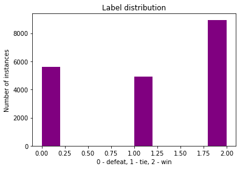
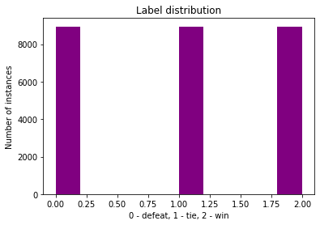

# KAGGLE FOOTBALL PREDICTION
### Team members: Mark-Eerik Kodar, Liina Anette Pärtel, Robin Sulg, Karl Riis


# TODO:
- Update the best hyperparameters if new and better are found

# Introduction

The aim of this project is to predict the outcome of a football match using a neural network. This neural network model will be compared to a baseline random forest classifier and in the end we will calculate how much money we would end up making or losing if we had bet 1 euro on each game. 

# Data
The dataset of that the model is trained on can be found here: https://www.kaggle.com/hugomathien/soccer. 
The dataset contains the statistics of over 25 000 matches and 10 000 players from the top divisions of 11 European countries. Each match has list of detailed events from the goal types, possession to fouls and cards. In addition to that, it also provides the betting companies odds for the matches. 


# Data preprocessing
While browsing the dataset it was obvious, that much of the information there was weirdly formatted and some of the data there was really not of use to use. 

Firstly, we disregarded the data that the model should not know beforehand. This meant that in the match information, data such as home team goals, away team goals, shots on target, shots off target, fouls committed, etc. were all removed.

Secondly, we threw away the player data, which was lacking in the sense that there were a lot of null values and also the player data was based on FIFA video game series which may not provide the most accurate estimate of a player's abilities. 

As for the more technical side of things, we dropped columns that contained null values and joined different tables in the dataset to help us in the later phases of the model development. Examples of this include creating features of match win percentage overall, home and away win percentages, win percentage against certain opponent and so on. Also, we noticed that the initial data was quite imbalanced as the labels of home team winning were in the majority as seen below. 



This problem was solved by oversampling using the <code>imbalanced-learn</code> package. After re-sampling the training dataset we got equal amount of labels for each class.



In addition to all that, we needed a way to test our model in a real-life scenario. The way we decided to do that, was to order the dataset by match dates take the last 3 months of matches as our test set on which we can simulate our betting. 

# Baseline model

    ## TODO

# Neural Network

We started our development of the neural network model by just adding some fully connected layers on top of each other, added L2 regularization, used ReLU activation function and used some fixed learning and dropout rate. The loss function that we used was categorical cross-entropy as this loss function suits best our multi-class classification task. This loss function also assumes, that the last layer has the same number of hidden nodes that there are classes and that the last layer uses softmax as an activation function.

This model did not turn out very well even though the validation accuracies were decent (~52%), as this model predicted home wins only. This meant several hours of research of things that could be wrong with our model. This research led us to believe, that our network has maybe too many layers and there might be a problem of ReLU nodes dying. The latter might also be caused too high of a learning rate. Therefore we decided to try whether grid search would help to solve that problem. 

Unfortunately it did not help and after doing some more research we started off from scratch. We decided to now use tanh activation function as with this function there was a smaller probability of neurons dying. We created a model that consisted of just two hidden layers. As seen below, the first layer had 8 units, the tanh activation function and L2 regularization. After that we added dropout and another fully connected layer with softmax activation function. Also we used Adam as the optimizer. 

```python
def create_model(learning_rate=1e-5, dropout_rate=0.1):
    model = Sequential() 
    model.add(Dense(8, input_dim=columns, activation='tanh', kernel_regularizer='l2'))
    model.add(Dropout(dropout_rate))
    model.add(Dense(3, activation='softmax'))
    model.compile(loss='categorical_crossentropy', optimizer=Adam(lr=learning_rate), metrics=['accuracy'])
    return model
```

After creating this new model we needed to find the best possible learning rate and dropout rate for our model. This was done again using grid search.

```python
learning_rates = [1e-3, 5e-3, 1e-4, 5e-4, 1e-5, 1e-6]
dropout_rates = [0.05, 0.1, 0.2]
hidden_sizes = [8, 16, 64, 128]

best_lr = None
best_dr = None
best_model = None

best_val_acc = 0

for lr in learning_rates:
    for dr in dropout_rates:
        for hs in hidden_sizes:
            model = create_model(lr, dr, hs)
            history = model.fit(
                X_train,
                y_train_categorical,
                epochs=100,
                validation_split=0.1,
                verbose=0)
            val_acc = max(history.history['val_accuracy'])
            if val_acc > best_val_acc:
                best_val_acc = val_acc
                best_lr = lr
                best_dr = dr
                best_model = model
        
```

With grid search we got that the best learning rate for us was 1e-5 and the best dropout rate was 0.2. 


# Betting
    # TODO