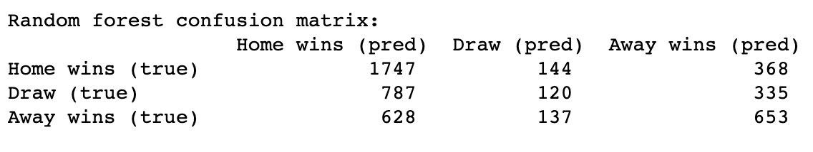
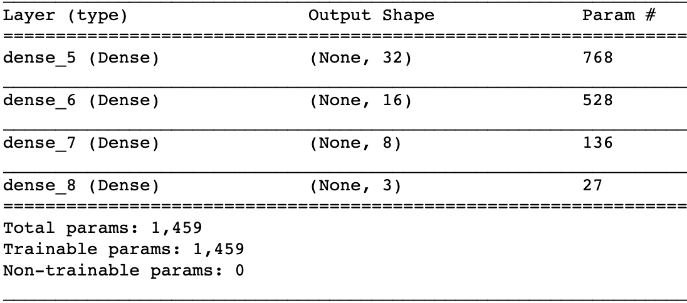
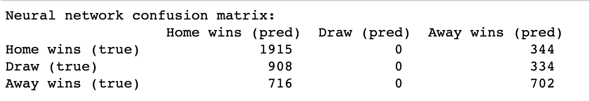

# KAGGLE FOOTBALL PREDICTION
# Team members: Mark-Eerik Kodar, Liina Anette Pärtel, Robin Sulg, Karl Riis

# Introduction

The aim of this project is to predict the outcome of a football match.  In short, our goal is to build a preliminary random forest model that can be compared to the final neural network model. 

# Data
The dataset of that the model is trained on can be found here: https://www.kaggle.com/hugomathien/soccer. 
The dataset contains the statistics of over 25 000 matches and 10 000 players from the top divisions of 11 European countries. Each match has list of detailed events from the goal types, possession to fouls and cards. In addition to that, it also provides the betting companies odds for the matches. 

# Data preprocessing
While browsing the dataset it was obvious, that much of the information there was weirdly formatted and much of the data there was really not of use to use. 

Firstly, we disregarded the data that the model should not know beforehand. This meant that in the match information, data such as home team goals, away team goals, shots on target, shots off target, fouls commited, etc. were all removed.

As for the more techincal side of things, we dropped columns that contained null values and joined different tables in the dataset to help us in the later phases of the model development.

# Baseline model

We chose a simple random forest model to act as a baseline. To implement this we chose the sklearn RandomForest model. The initial model without much tuning returned 51.2% accuracy. 

Below is the confusion matrix of the predictions of the model. 

# Neural Network

We built our model using Keras with the following architecture:

In depth, the first layer uses ReLU as an activation function and uses L2 regularization with the value of 0.0002. The next two layers have the same setup. The fourth layer uses softmax as an activation function and has the same regularization parameter. 

The current model has an accuracy of 53.2%, but as we can see from the confusion matrix below, then there is a problem with our model, as it does not predict any draws which we'll have to work on later.

# Work that still needs to be done:

We have yet to try out and think through the architecture of the neural network. In addition to that we have yet to do any pruning or hyperparameter optimization.